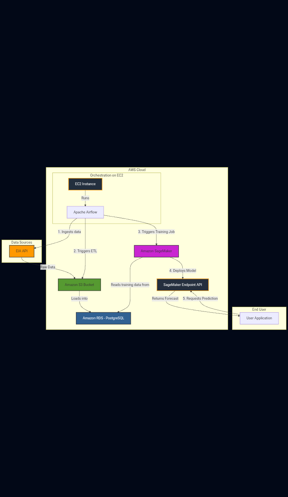

# Automated Energy Demand Forecasting Pipeline

[](https://www.python.org/downloads/)
[](https://opensource.org/licenses/MIT)
[]()

An end-to-end, cloud-native MLOps pipeline that automatically ingests energy data, trains a forecasting model, and deploys it for real-time predictions. This project demonstrates a full data lifecycle, from raw data to a production-ready machine learning model, orchestrated on AWS.

## Table of Contents
- [Problem Statement](#problem-statement)
- [Key Features](#key-features)
- [Tech Stack](#tech-stack)
- [System Architecture](#system-architecture)
- [Local Setup and Installation](#local-setup-and-installation)
- [Usage](#usage)
- [Future Improvements](#future-improvements)
- [Contact](#contact)

## Problem Statement

Traditional energy demand forecasting often involves manual data pulls, ad-hoc model training, and a disconnect between data science and production environments. This process is time-consuming, prone to error, and not easily scalable.

This project aims to solve that problem by creating a robust, automated pipeline that handles the entire machine learning lifecycle. It serves as a blueprint for building production-grade MLOps systems, ensuring that forecasting models are always up-to-date, reliable, and easily accessible.

## Key Features

* **Automated Data Ingestion:** The pipeline automatically fetches the latest hourly energy demand data daily from the U.S. Energy Information Administration (EIA) API.
* **Scalable Data Storage:** Raw data is stored in a durable and cost-effective data lake using Amazon S3, while processed data is structured in a relational database on Amazon RDS.
* **Workflow Orchestration:** Apache Airflow is used to schedule and manage the entire ETL and model training workflow, ensuring reliability and easy monitoring.
* **Managed Model Training & Deployment:** Model training and deployment are handled by Amazon SageMaker, a fully managed service that provides a scalable, production-ready REST API endpoint for predictions.
* **Containerization:** The core application components are containerized with Docker, ensuring consistency between development and production environments.

## Tech Stack

| Category              | Technology                                                                                                    |
| --------------------- | ------------------------------------------------------------------------------------------------------------- |
| **Cloud Provider** | **Amazon Web Services (AWS)** |
| **Orchestration** | **Apache Airflow** |
| **Containerization** | **Docker** |
| **Infrastructure** | **Amazon EC2**, **Amazon S3**, **Amazon RDS (PostgreSQL)** |
| **Machine Learning** | **Amazon SageMaker**, **Scikit-learn** |
| **Data Processing** | **Python**, **Pandas** |
| **Programming Language**| **Python 3.9+** |


## System Architecture

The pipeline follows a modern data architecture, moving data from ingestion to a final, queryable API endpoint.



## Local Setup and Installation

To run this project locally for development and testing, follow these steps:

1.  **Clone the repository:**
    ```bash
    git clone [https://github.com/](https://github.com/)[Your-GitHub-Username]/energy-forecast-pipeline.git
    cd energy-forecast-pipeline
    ```

2.  **Create and activate a Python virtual environment:**
    ```bash
    python3 -m venv venv
    source venv/bin/activate
    ```

3.  **Install dependencies:**
    ```bash
    pip install -r requirements.txt
    ```

4.  **Set up environment variables:**
    Create a `.env` file in the root of the project directory. This file should **not** be committed to Git. Add your credentials and configurations:
    ```env
    # EIA API Key
    EIA_API_KEY="YOUR_API_KEY_HERE"

    # Local PostgreSQL Connection
    DB_USER="postgres"
    DB_PASSWORD="your_password"
    DB_HOST="localhost"
    DB_PORT="5432"
    DB_NAME="energy_db"
    ```

5.  **Run Airflow with Docker:**
    Make sure you have Docker Desktop installed and running. Follow the official Airflow documentation to run Airflow with Docker Compose.

## Usage

1.  **Orchestration:** Once Airflow is running, you can access the Airflow UI (usually at `http://localhost:8080`) to monitor and manually trigger the `energy_demand_dag`.
2.  **Prediction API:** After the pipeline has run successfully on AWS, the model will be deployed to a SageMaker endpoint. Predictions can be requested by sending a POST request with the required features in JSON format to the endpoint URL.

    Example using `curl`:
    ```bash
    curl -X POST https://[your-sagemaker-endpoint-url] \
    -H "Content-Type: application/json" \
    -d '{"features": [0.5, 0.8, ...]}'
    ```

## Future Improvements

This project serves as a strong foundation. Future enhancements could include:
* **Advanced Modeling:** Implement more sophisticated forecasting models like Prophet, LSTMs, or XGBoost.
* **Additional Data Sources:** Integrate external features like weather data or economic indicators to improve model accuracy.
* **CI/CD Pipeline:** Build a CI/CD pipeline using GitHub Actions to automate testing and deployment.
* **Infrastructure as Code (IaC):** Use Terraform or AWS CloudFormation to define and manage all AWS infrastructure in code.
* **Model Monitoring:** Implement a system to monitor the production model for data drift and performance degradation over time.

## Contact

- **Author:** Eric Scott
- **LinkedIn:** https://www.linkedin.com/in/eric-scott-0b3a4ab9
